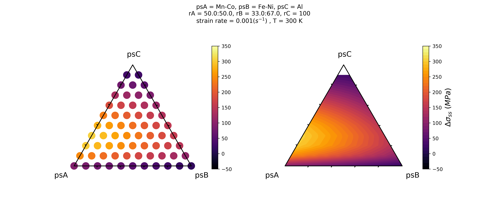
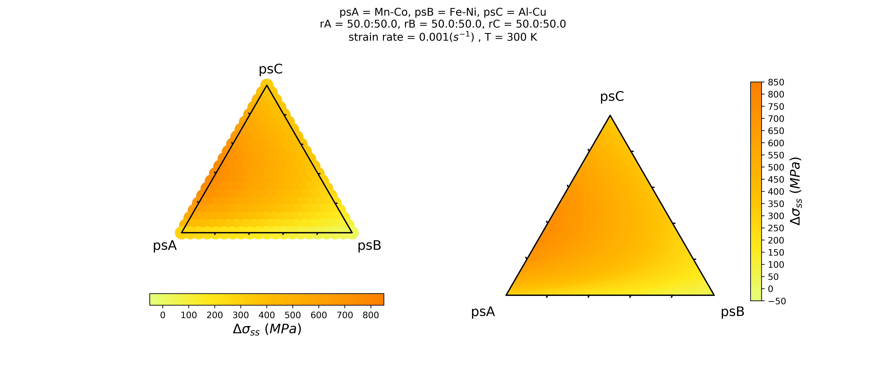

# SSPredict: Solid-Solution Strengthening Prediction

[](https://opensource.org/licenses/MIT)

<!-- toc -->

## 1.  Introduction

SSPredict is a command line tool to visualize the [solid solution strengthening](https://en.wikipedia.org/wiki/Solid_solution_strengthening) stresses of **Complex concentrated alloys (CCAs)**.

[Complex concentrated alloys (CCA)](https://scholar.google.com/scholar?hl=en&as_sdt=0%2C15&q=complex+concentrated+alloys&btnG=) is an emerging class of multi-component alloy with promising properties and unexploit possibilities. Accelerating the discovery of high strength CCAs based on solid solution strengthening is challenging because of their complicated compositions. 

This tool is designed to **visualize** the solid solution strengthening stress regarding the combinations of components and the vast composition space of CCAs. Users are allowed to change alloying combinations and concentrations to explore the strengthening effects. The formulations are based on an elasticity-based model for random solid solution alloys. [^1,2,3]


## 2.  Required Packages

It is a python3-based tool, currently not working well on python2.  2.1  Packages 

- **matplotlib** (code version 1.13.3)

- **numpy** (code version 2.1.0)

- **pandas** (code version 0.23.4)


## 3.  Usage

### Using the tool with installation

If you want to use the tool in any folder or project you like, please read [INSTALL.md](/INSTALL.md) to install the code.  


### Using the tool WITHOUT INSTALLATION

#### Clone the tool to where you want to start the project:

```
$ cd /path/to/dir
$ git clone https://github.com/DS-Wen/SSPredict.git
```

#### Setup input file

[Here to see the input file setup and examples](/examples/input_guide.md)

#### 📍 Predict the strengths

Under sspredict/ 

```
$ cd /path/to/sspredict/
```

Use predictss.py to predict data from an inputfile

```
$ python3 predictss.py -f inputfile -o outputfile_for_plot  
```

Where outputfile_for_plot is a .txt file including input information and data generated.  

Details of the generated data are described in the [data_description.pdf](examples/output_description.pdf)

#### 📍 Plot the strengths with the outputfile_for_plot

```
$ python3 predictss.py -f outputfile_for_plot
```

or to save the .png directly:

```
$ python3 predictss.py -f outputfile_for_plot -s xxx
```


## 4. Examples






If there’s any questions or advice, please [open an issue](https://github.com/DS-Wen/SSPredict/issues/new) or [email us](mailto:wen94@purdue.edu?subject=[Github]%20SSPredict).


[^1]: [Varvenne, Céline, Aitor Luque, and William A. Curtin. "Theory of strengthening in fcc high entropy alloys." *Acta Materialia*118 (2016): 164-176.](https://doi.org/10.1016/j.actamat.2016.07.0401)  
[^2]: [Varvenne, Céline, et al. "Solute strengthening in random alloys." *Acta Materialia* 124 (2017): 660-683.](https://doi.org/10.1016/j.actamat.2016.09.046)  
[^3]: [Varvenne, Céline, and William A. Curtin. "Predicting yield strengths of noble metal high entropy alloys." *Scripta Materialia* 142 (2018): 92-95.](https://doi.org/10.1016/j.scriptamat.2017.08.030)

