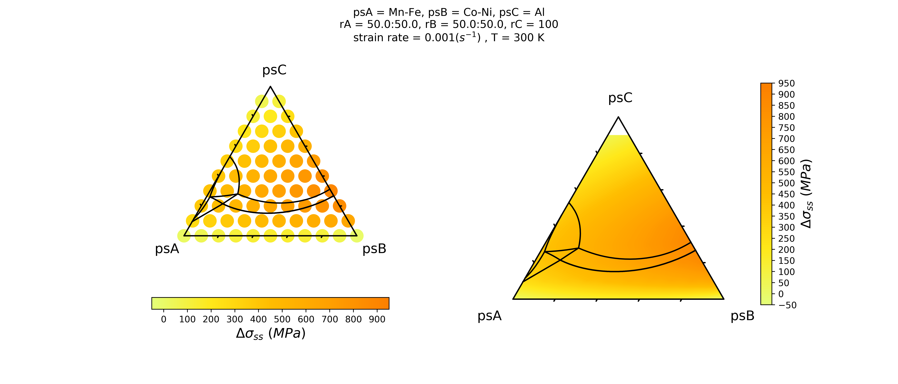

# Tutorial
You can start your own project in any folder you like:
```  
$ cd /path/to/yourprojectfolder
```
## Strength Prediction  
Make sure your input_file is in the project directory, see [input_description for strength prediction](/examples/input_guide.md)  
start your prediction with:  
```  
$ sspredict.predict -f input_file -o predicted_data
```
And your data is in your output file "predicted_data".  
#### Example - MnFe-CoNi-Al
``` 
$ cd examples/MnFe-CoNi-Al/ 
$ sspredict.predict -f MnFe-CoNi-Al_input -o MnFe-CoNi-Al_result
```
The output [MnFe-CoNi-Al_result.txt](/examples/MnFe-CoNi-Al/MnFe-CoNi-Al_result.txt) is a csv file and contains the calculated data. The first few lines are the same as your input file. What you are looking for is the line "Start of Predicted Data". You can find the [description of the output file here](/examples/output_description.pdf).  
```
Start of Predicted Data
psA,psB,psC,Mn,Co,Fe,Ni,Al,V_ave,b_ave,E_ave,mu_ave,nu_ave,sum_cnVn^2_b6,Ty0_tensile,Delta_Eb,Delta_sigma_ss
0.0,0.0,1.0,0.0,0.0,0.0,0.0,1.0,16.472000000000005,2.85597089425,65.498,23.922,0.36899088705,0.0,0.0,0.0,nan
0.0,0.1,0.9,0.0,0.0,0.033,0.067,0.9,15.957133333333337,2.82589892302,73.1007,26.8945633333,0.359023738255,0.00474252260216,227.113095006,0.815851251353,26.797377448
0.0,0.2,0.8,0.0,0.0,0.067,0.133,0.8,15.442266666666669,2.79517293118,80.7034,29.8671266667,0.351040575491,0.00901643003883,377.753876401,1.07303776777,57.7413207451
......
```  

## Plot Strength Pseudo-Ternary Diagram
Once you have the predicted data, you can plot the data as a contour pseudo-ternary diagram:  
```  
$ sspredict.plot -str predicted_data 
```
Or you can save it the image as .png file:  
```  
$ sspredict.plot -str predicted_data -s image_name
```

#### Example - MnFe-CoNi-Al
```  
$ sspredict.plot -str MnFe-CoNi-Al_result.txt -s MnFe-CoNi-Al_plot 
```
You will be able to get a diagram: 
The input information is printed on top of the plot. 


## Plot Strength and Phase Diagram in one Pseudo-Ternary Plot
You can also combine your strength contour plots with the corresponding phase diagram:
1. Make sure you make a file ('phase_diagram') generated from ThermoCalc.  
2. In ThermoCalc console mode, you generate a phase diagram for your system at desired temperature.  
3. Make sure your phase diagram share the same coordinate as the pseudo-ternary strength contour plot.  
4. You can generate a file of coordinates in from the ThermoCalc console mode. The file looks like this [example of MnFe-CoNi-Al](/examples/MnFe-CoNi-Al/PD_MnFe-CoNi-Al). The file contains the coordinates of phase boundaries in your phase diagram.  
5. Put this phase diagram file in your project folder. 
Then use: 
```  
$ sspredict.plot -str predicted_data -pd phase_diagram 
```
And save the image by:
```  
$ sspredict.plot -str predicted_data -pd phase_diagram -s image_name
```

#### Example - MnFe-CoNi-Al
The [phase diagram file example](/examples/MnFe-CoNi-Al/PD_MnFe-CoNi-Al) generated from ThermoCalc is like: 

```

 Phase Region for:
     LIQUID                        
     BCC_A2                        
     FCC_A1                        
 col-1=X(NI), col-2=X(AL),
   5.86048E-02   2.14360E-01

 Phase Region for:
     LIQUID                        
     BCC_A2                        
     FCC_A1                        
 col-1=X(NI), col-2=X(AL),
   5.86048E-02   2.14360E-01
   5.85923E-02   2.14373E-01
......
```

To combine phase diagram and strength contour:

```
$ sspredict.plot -str MnFe-CoNi-Al_result.txt -pd PD_MnFe-CoNi-Al -s MnFe-CoNi-Al_strength_phase
```
You will get: 

